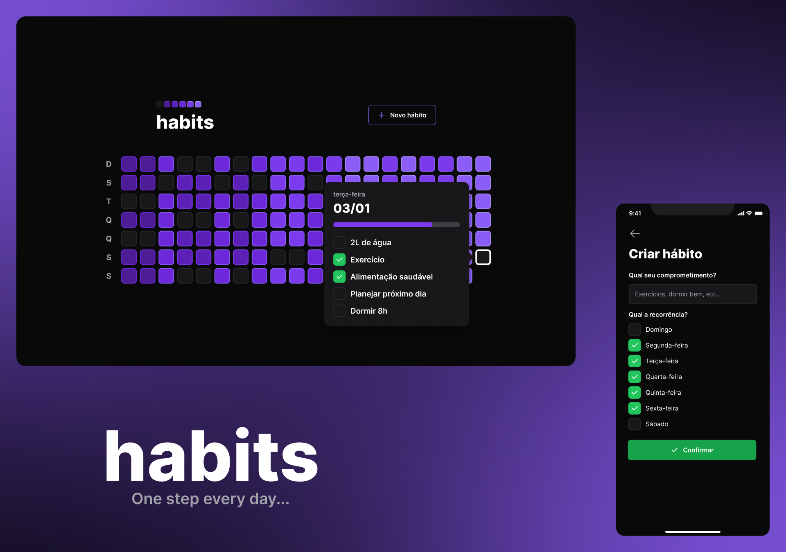

 <h1 align="center">
    
</h1>

<p align="center">
  <a href="#-project">Project</a>&nbsp;&nbsp;&nbsp;|&nbsp;&nbsp;&nbsp;
  <a href="#-technologies">Technologies</a>&nbsp;&nbsp;&nbsp;|&nbsp;&nbsp;&nbsp;
  <a href="#-run-locally">Run Locally</a>
</p>

<br>

<p align="center">
  
</p>

## 💻 Project

Habits is a project to help you get into new habits and maintain current ones by listing your daily activities and keeping track of what you have accomplished during the day.

It also shows you a easy to compreend progress chart so you can get a better idea of how you may improve and reach new accomplishments.

You can check each project at their respective repositories:

- [Backend Server](https://github.com/nbc7/nlw-habits-server)
- [Web](https://github.com/nbc7/nlw-habits-web)
- [Mobile](https://github.com/nbc7/nlw-habits-mobile)

## 🚀 Technologies

The technologies used in this project are the following:

- [TypeScript](https://www.typescriptlang.org/)
- [Node.js](https://nodejs.org/en/)
- [Fastify](https://www.fastify.io/)
- [Prisma](https://www.prisma.io/)
- [Day.js](https://day.js.org/)
- [Zod](https://zod.dev/)

## ⚙ Run Locally

**Server:**

Install dependencies

```bash
npm install
```

Rename the `.env.example` file to `.env` and make changes if you need

Run the migrations

```bash
npx prisma migrate dev
```

Start the server

```bash
npm run dev
```
